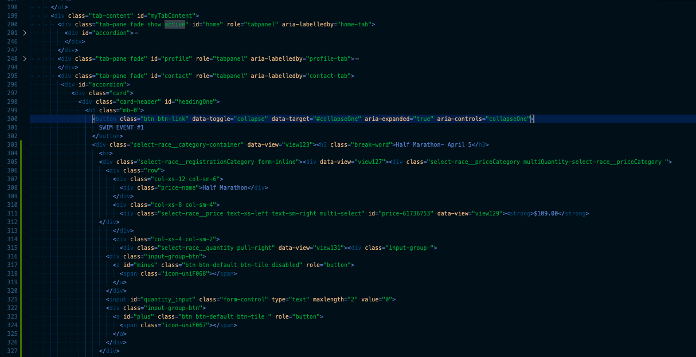
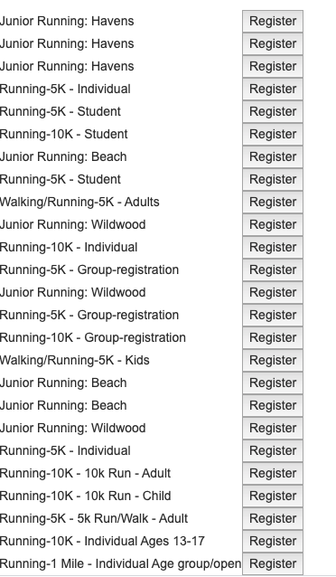

# Project-02
Project functionality:

This project is about a website which will help users search for nearby events related to sports. They can also register for events to participate.
The user can register and login to the website to save the events that they have registered for. The user may also login through google account as well.

Techonologies used: 
1. HTML
2. CSS
3. NodeJS
4. MYSQL

Libraries used:
1. express
2. crypto-js
3. express-session
4. popper 
5. Google sign-in integration library
6. mysql

Implementation Details:
The user registration/login:  A user database was created to store user name, password and provider information (whether the user had registered with the website directly or is visiting using Google account). The password of the user is being stored with one-way hash encryption (SHA256). A session is created for a successful user login to track user activities. A registration UI element and login UI element is created for the user to register and login to the website. For users wanting to use Google account for login and registration - a google sign-in button has been introduced using Google provided html and javascript code. This code requires a Google api key (which we temporarily created for this project).

code for saving encrypted one-way hash(SHA256) encrypted password
''' javascript

    if(data[0].provider){
          if(data[0].provider && data[0].provider == "events"){
              var encryptedPassword = Crypto.SHA256(req.body.password).toString();
              if( data[0].password == encryptedPassword){
                  req.session.userid = req.params.email;
                  res.json({ result:"success" });
                
             }else{
                
                res.json({ result:"fail" });
            }
        }else{
            req.session.userid = req.params.email;
            res.json({ result:"success" });
        }
    }else{
        res.json({ result:"fail" });
    }

    });
    '''
code for searching events using active api call
'''javascript

        router.post("/api/events", function(req, res) {
          var startDate = req.body.date;
          var lon = req.body.lon;
          var lat = req.body.lat;
          var query = req.body.query;
          var queryURL = "http://api.amp.active.com/v2/search?category=event&radius=20&sort=distance&api_key=9eqk4qg7mf27c4qwe5vxd79r&start_date="+
          startDate+"..&"+query;

          console.log(queryURL);
          request(queryURL,{json: true}, function(err,result,body){
              if(err)
              return console.log(err);
              // console.log(body);
              res.json (body);
          });   
      });
    '''
    
##Screenshots

###here is a view of the adaptability of the app

###here is a view of the app running in an iPhoneX view

###here is the code which allowed for the accordian capabilities

###here is a snippet of the various events one can register for. 

    